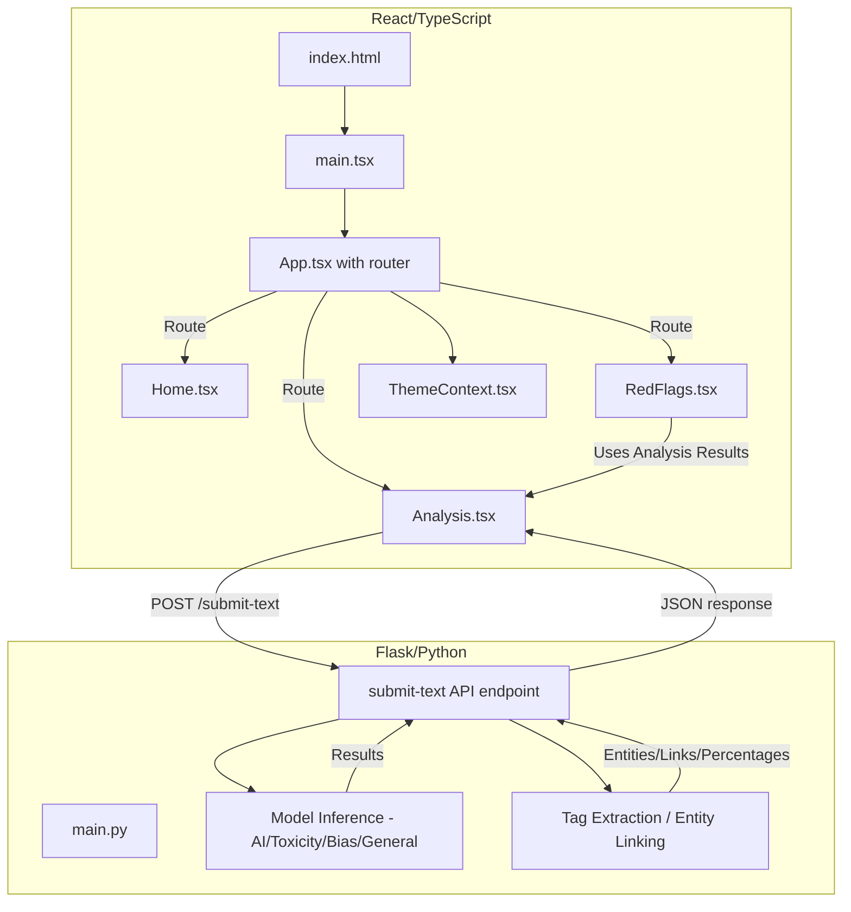
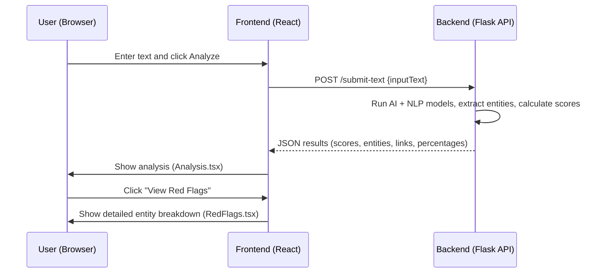

```mermaid
flowchart TD
    subgraph Frontend [React/TypeScript]
        A1[index.html]
        A2[main.tsx]
        A3[App.tsx with router]
        A4[Home.tsx]
        A5[Analysis.tsx]
        A6[RedFlags.tsx]
        A7[ThemeContext.tsx]
    end

    subgraph Backend [Flask/Python]
        B1[main.py]
        B2[submit-text API endpoint]
        B3[Model Inference - AI/Toxicity/Bias/General]
        B4[Tag Extraction / Entity Linking]
    end

    A1 --> A2
    A2 --> A3
    A3 -->|Route| A4
    A3 -->|Route| A5
    A3 -->|Route| A6
    A3 --> A7
    A5 -->|POST /submit-text| B2
    A6 -->|Uses Analysis Results| A5
    B2 --> B3
    B2 --> B4
    B3 -->|Results| B2
    B4 -->|Entities/Links/Percentages| B2
    B2 -->|JSON response| A5

```

```mermaid
sequenceDiagram
    participant User as User (Browser)
    participant FE as Frontend (React)
    participant PY as Backend (Flask API)

    User->>FE: Enter text and click Analyze
    FE->>PY: POST /submit-text {inputText}
    PY->>PY: Run AI + NLP models, extract entities, calculate scores
    PY-->>FE: JSON results (scores, entities, links, percentages)
    FE->>User: Show analysis (Analysis.tsx)
    User->>FE: Click "View Red Flags"
    FE->>User: Show detailed entity breakdown (RedFlags.tsx)
```

